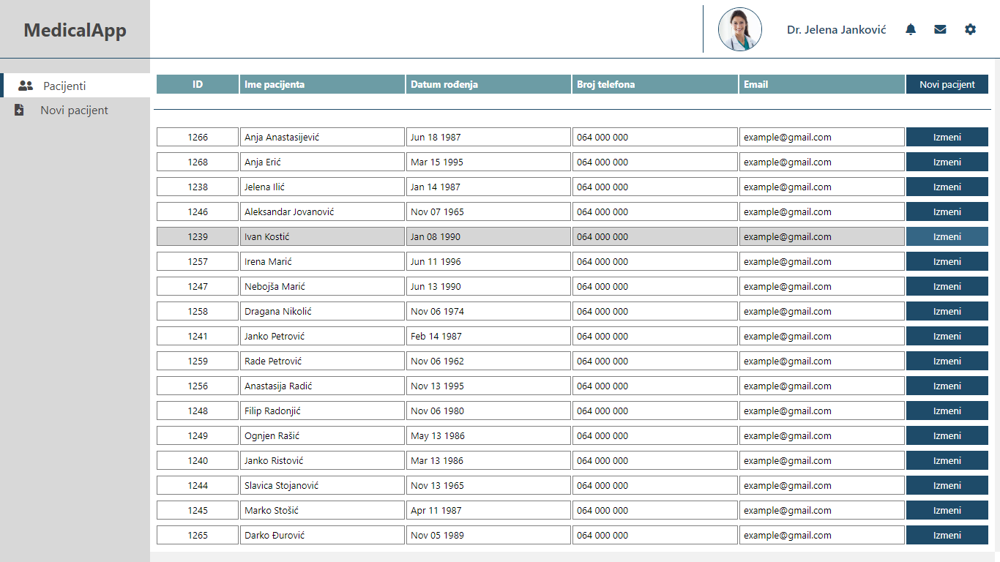
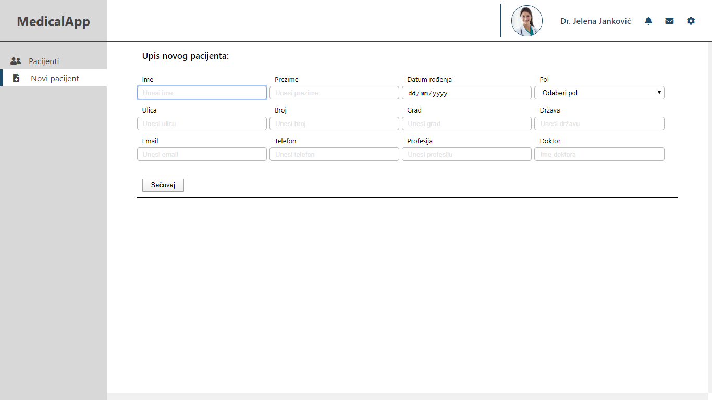
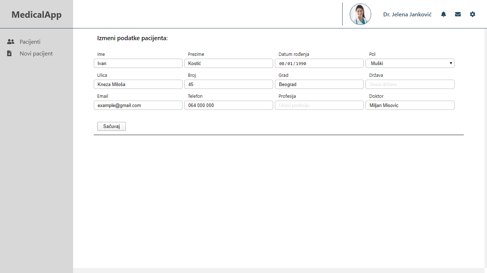

## Medical App (React & JSON Server)

<br>





<br>

### Installation

> 1. Clone the repo

```sh
git clone https://github.com/m-misovic/MedicalApp.git
```

> 2. Install NPM packages

```sh
npm install
```

> 3. Start JSON server

```sh
npm run server
```

> 4. Start project

```sh
npm run start
```
